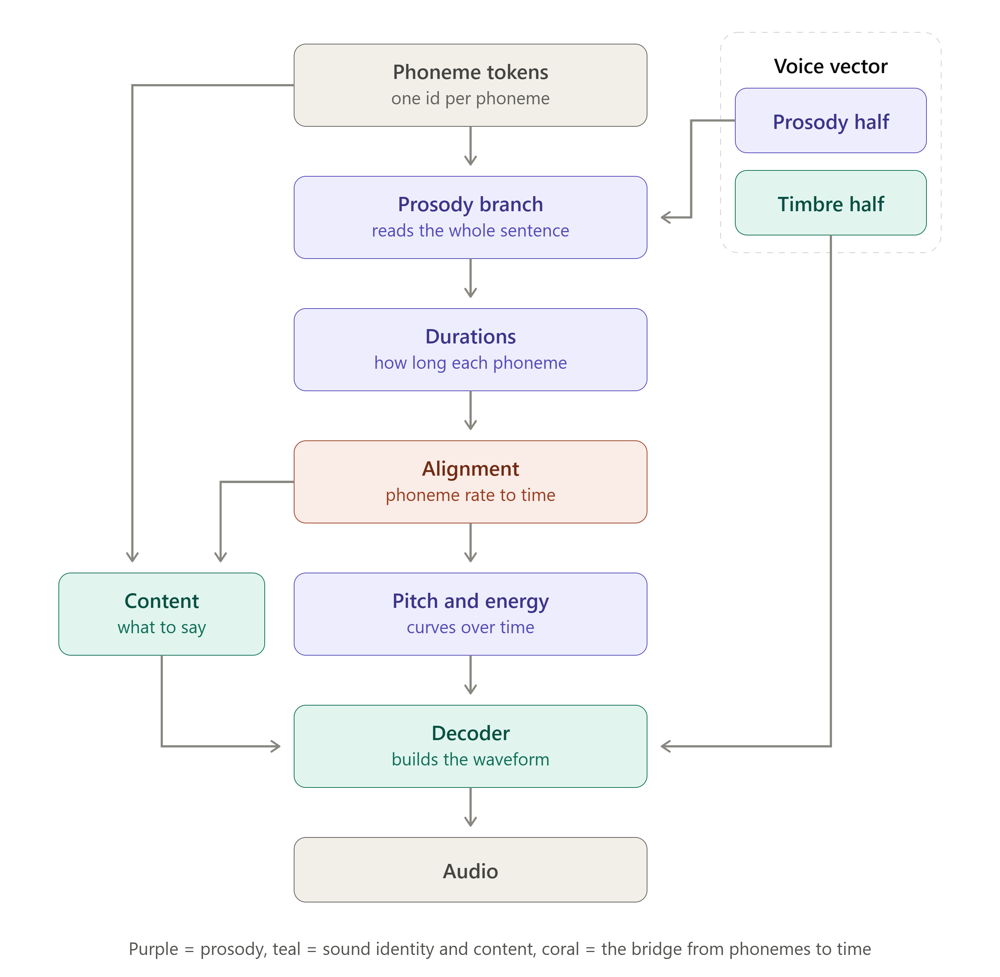

# input of the model

```         
text → misaki (KPipeline, lang_code='i')
           └─ espeak-ng  →  raw IPA
           └─ misaki post-processing (normalize → map to Kokoro symbol set)
       → phoneme string → token IDs → model
```

- **misaki** is Kokoro's grapheme-to-phoneme (G2P) engine. For Italian it wraps `espeak-ng` and maps the output into misaki's own symbol set. Author's note in misaki: the symbols are *"intended as input tokens for neural networks,"* not strict IPA, so a few glyphs are repurposed.

- Each phoneme character maps to one integer via the vocab dictionary ([see here](vocab_dict_kokoro.md)). Also check available and not available foreign phonemes.

- **For stimulus manipulation you can bypass G2P and feed a phoneme string directly**, as long as every character exists in the vocab. This is the intended lever for controlled edits (lengthening, stress shifts, segment substitution, etc.).

- The default process after phoneme tokenized

{fig-align="center" width="516"}
## Code layout

| file | contents |
|---|---|
| [`text_manipulation.py`](text_manipulation.py) | text → IPA (`text_to_ipa_chunks`), vocab check (`check_ipa`), the substitution engine (`Rule`, `manipulate`) and the statistics (`substitution_stats`, `print_stats`). Loads only espeak-ng G2P — and lazily — never the acoustic model. |
| [`speech_generation.py`](speech_generation.py) | the Kokoro model (`get_model`, loaded lazily), voices (`load_voice`), plain synthesis (`synthesize`), prosody extraction (`extract_prosody`) and generation with a donor's prosody forced onto it (`synthesize_forced`, `synthesize_pair`). |
| [`functions.py`](functions.py) | phoneme/audio alignment (`align_phonemes`, `align_speech`, `synth_aligned`) and the interactive HTML player (`audiovisualize_interactive`). Re-exports the other two modules, so existing `from functions import ...` calls keep working. |
| [`example_text_manipulation.py`](example_text_manipulation.py) | runnable walkthrough: G2P, deterministic rules, weighted rules, statistics, alteration mask, vocab check. |
| [`example_speech_generation.py`](example_speech_generation.py) | runnable walkthrough: baseline audio, free manipulated audio, and manipulated audio with the baseline's prosody forced. |

### Manipulation in one rule kind

There is a single rule kind, the weighted substitution — aspiration, palatalization,
nasalization and the old language presets are all special cases of "this phoneme
becomes that one, with probability *p*":

```python
ipa   = text_to_ipa_chunks(text)
rules = [
    {"map": {"t": {"ʈ": 70, "t": 30}}, "same_in_word": True},   # 70% of /t/ → ʈ
    {"map": {"b": "β", "d": "ð"}, "scope": "outside_cluster"},  # deterministic, singletons only
]
manip, masks = manipulate(ipa, rules, seed=42, return_mask=True)
stats = substitution_stats(ipa, manip, rules)     # compares the two chunk lists
```

`manipulate()` only rewrites; the statistics are a separate comparison of the
original and manipulated chunks, so they report what came out — including the net
effect of rules that chained. `masks` marks every altered character and is what
`synth_aligned(masks=...)` forwards to the visualiser for highlighting.

### Forcing the baseline's prosody

Left alone, Kokoro re-predicts timing and pitch for the manipulated phoneme
string, so changing one /p/ moves every following word. Forcing the baseline's
prosody keeps the pair comparable — the two recordings then differ only in the
manipulated segments:

```python
baseline, manipulated = synthesize_pair(ipa, manip, "im_nicola", seed=0)
manipulated.save("stimulus.wav")
```

Donor and target are the same utterance, but a rule can change the token count
(`p → pʰ` adds one, `tʃ → ʨ` removes one). The transfer aligns the two phoneme
strings: tokens that are unchanged or substituted 1:1 take the donor's duration
and frames, a token the rule *inserted* (ʰ, ʲ, ◌̃) simply keeps its own predicted
duration, and an n:m rewrite is fitted to the donor block's total. So the timeline
only moves where a token was added or removed — everything else stays sample-aligned.
